## Part 1. Установка ОС
Версия Ubuntu \
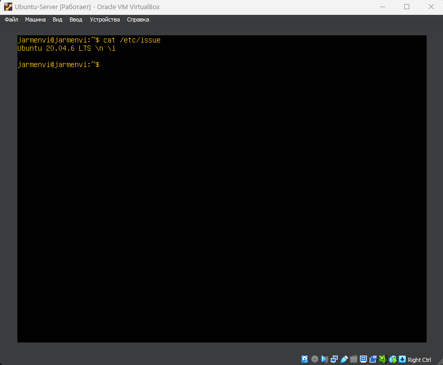 \

## Part 2. Создание пользователя
Создание нового пользователя и добавление его в группу adm \

## Part 3. Настройка сети ОС
1. Для задания имени машины в Ubuntu 20.04 можно ипользовать команду: \
hostnamectl set-hostname hostname \
где hostname новое имя машины

2. Для изменеия часового пояса можно использовать команду: \
sudo timedatectl set-timezone your_time_zone \
где your_time_zone указывается в соответствии со списком, выдаваемым командой: \
timedatectl list-timezones \
например в моем случае комана выглядела так: \
sudo timedatectl set-timezone Europe/Moscow \
Чтобы вывести часовой пояс текущей системы используется команда: \
timedatectl \

3. Для вывода списка интерфейсов можно использовать команду: \
ls /sys/class/net \
lo (loopback device) – виртуальный интерфейс, присутствующий по умолчанию в любом Linux. Он используется для отладки сетевых программ и запуска серверных приложений на локальной машине. \

4. Для вывода ip адреса, выданного DHCP сервером, используется команда: \
ip address \
DHCP - Dynamic Host Configuration Protocol. Служит для назначения IP-адреса \

5. Для просмотра внешнего ip-адреса шлюза можно использовать команду: \
wget -q -O -  ifconfig.me/ip, в моем случае это 188.162.39.127 \
А для внутреннего: \
ip route | grep default, в моем случае это 10.0.2.2 \

6. Используя следующуя команду отключаем DHCP и задаем статические значения ip адреса и DNS сервера в файле \
sudo nano /etc/netplan/00-installer-config.yaml \
После применяея изменения командой \
sudo netplan apply \

7. После перезагрузки все параметры сохранились

8. Для того чтобы пропинговать удаленные хосты используется команда  \
ping hostaddress \
где hostaddress адрес кторый требуется пропинговать \
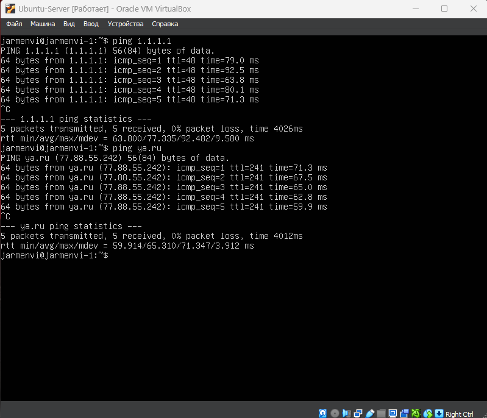 \

## Part 4. Обновление ОС
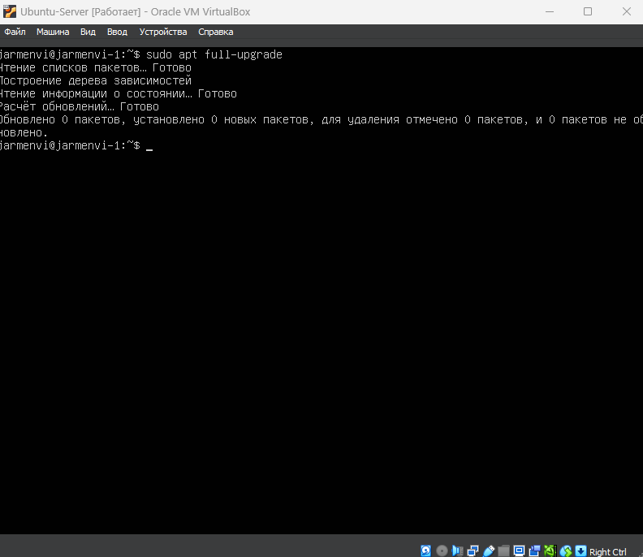 \

## Part 5. Использование команды sudo
sudo (англ. Substitute User and do, дословно «подменить пользователя и выполнить») — программа для системного администрирования UNIX-систем, позволяющая делегировать те или иные привилегированные ресурсы пользователям с ведением протокола работы. Основная идея — дать пользователям как можно меньше прав, при этом достаточных для решения поставленных задач. \
Команда sudo предоставляет возможность пользователям выполнять команды от имени суперпользователя root, либо других пользователей.
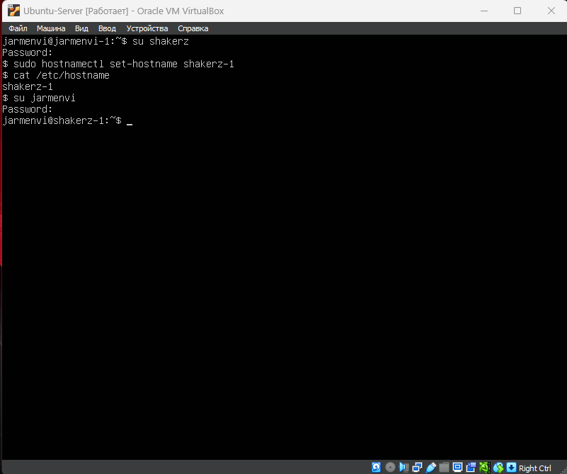 \

## Part 6. Установка и настройка службы времени
 \

## Part 7. Установка и использование текстовых редакторов
VIM \
Для выхода и сохранения используется команда :wq \
Для выхода без сохранения команда :q! \
 \
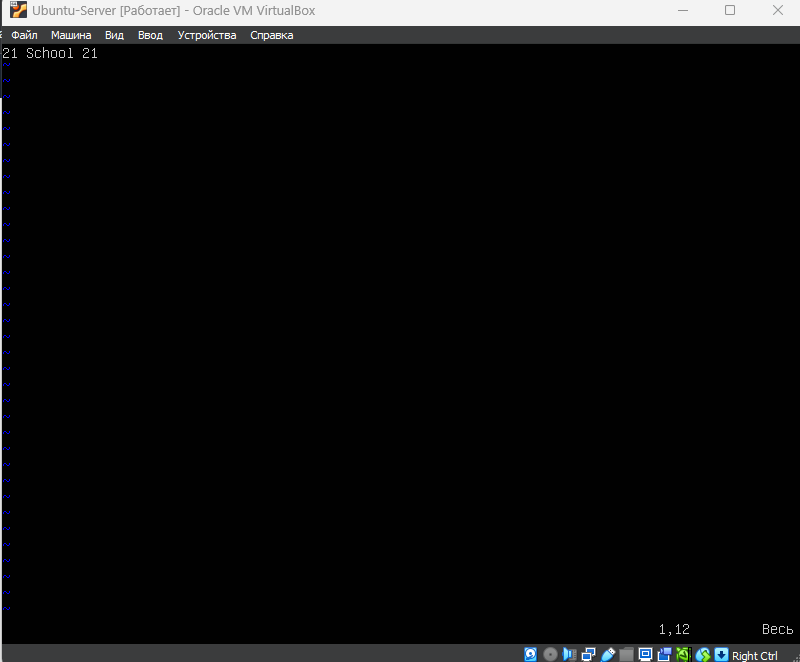 \
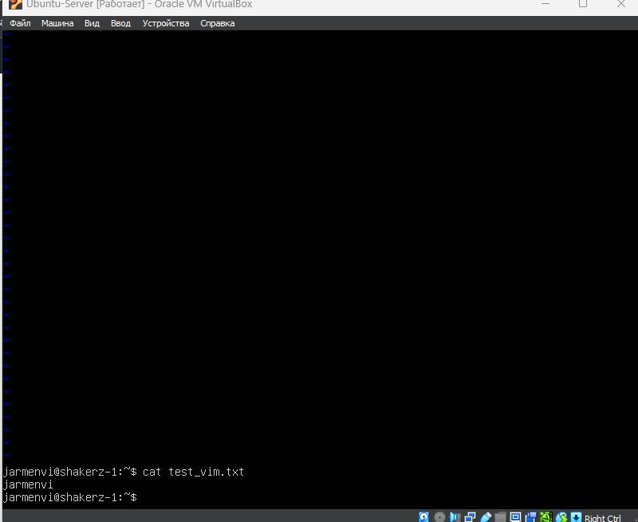 \
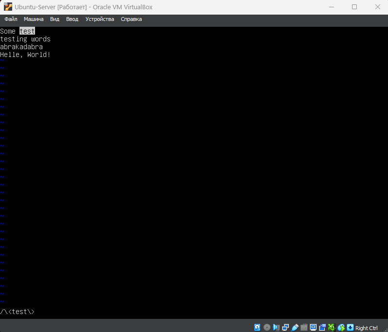 \
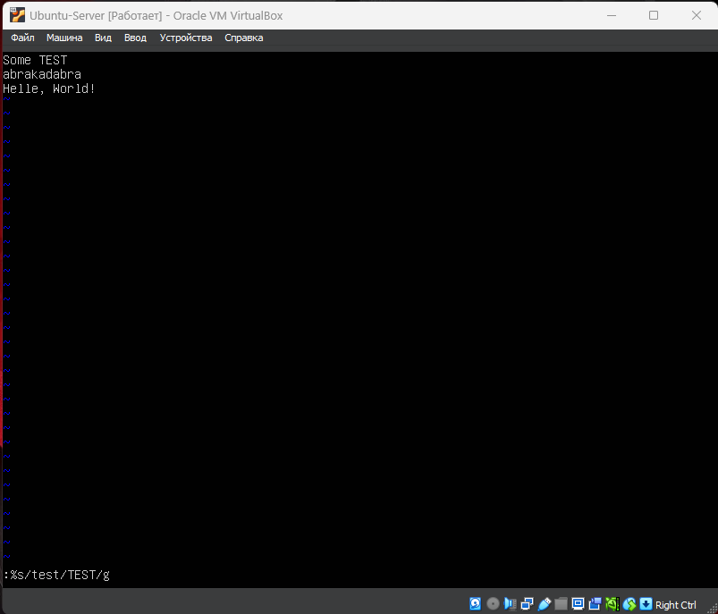 \

Nano \
Для сохранения используется последовательность клавиш \
Ctrl+X \
Y \
Enter \
Для выхода без сохранения используется последовательность \
Ctrl+X \
N \
Для поиска комбинация Ctrl+W \
Для поиска и замены \
Ctrl+ \
ввести строку для поиска \
Enter \
ввести строку на которую заменить \
Enter \
для каждого совпадения Y/N заменить/не заменять \
 \
 \
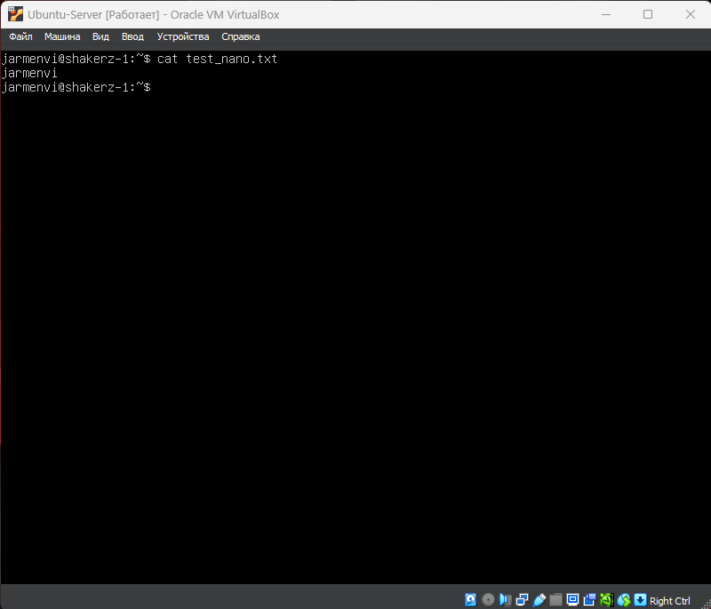 \
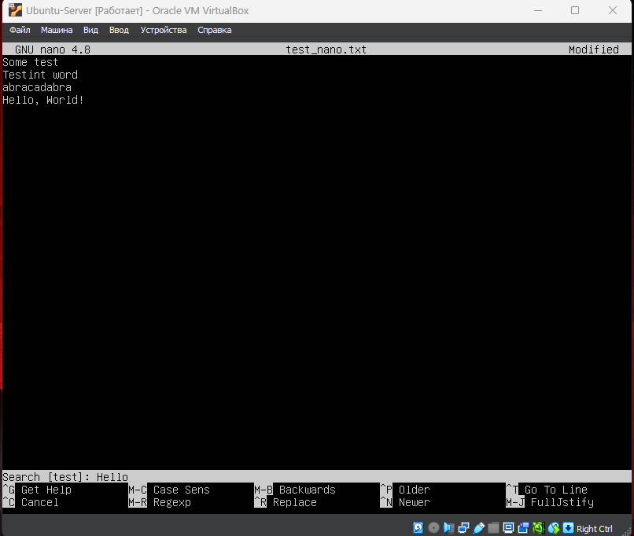 \
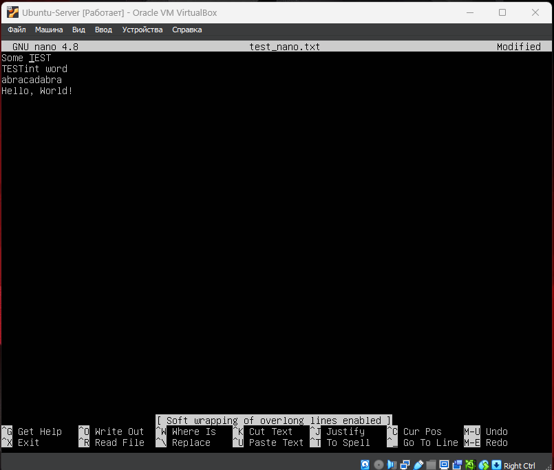 \

MCEDIT \
выбор файла стрелками в катаоге \
F4 для перехода в режим правки \
F2 для сохранения \
F10 для выхода, если прпустить F2 то это выход без сохранения при подтверждении в отдельном окне \
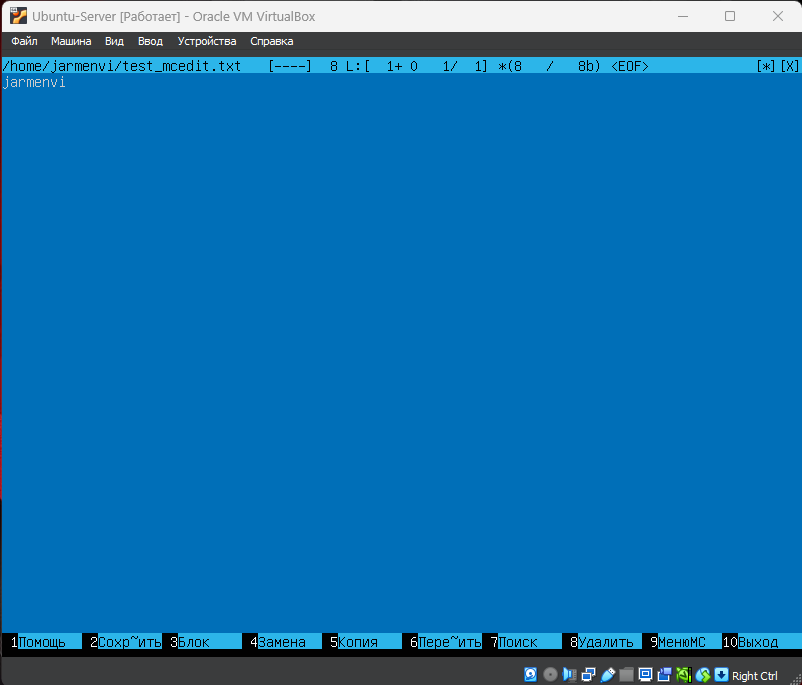 \
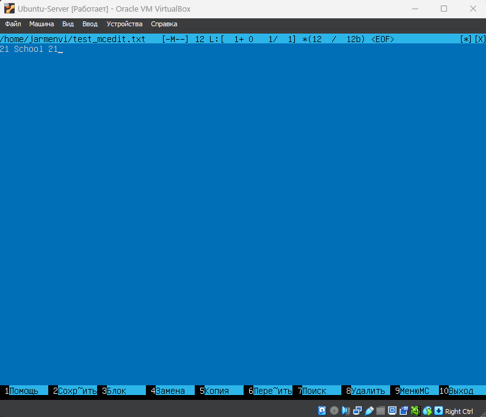 \
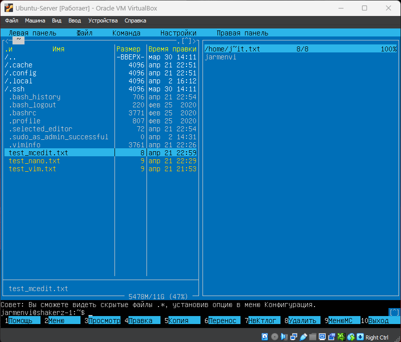 \
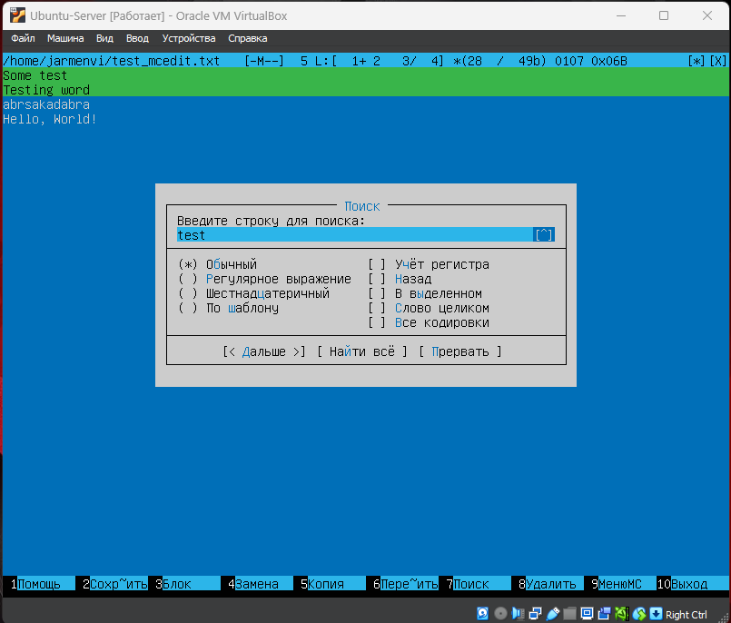 \
 \

## Part 8. Установка и базовая настройка сервиса SSHD
Установить службу SSHd. \
sudo apt-get install ssh \
sudo apt install openssh-server \
 \
Добавить автостарт службы при загрузке системы. \
sudo systemctl enable sshd \
 \
Перенастроить службу SSHd на порт 2022. \
В текстровом редакторе открыть файл /etc/ssh/sshd_config \
Поменять строку "#Port 22" на "Port 2022" \
 \
Используя команду ps, показать наличие процесса sshd. \
ps aux | grep "sshd" \
Команда ps является очень гибким инструментом для определения работающих в системе программ и оценки используемых ими ресурсов. \
a : связанные с конкретным терминалом, кроме главных системных процессов сеанса, часто используемая опция; \
x : процессы, отсоединённые от терминала (фоновые); \
u : пользовательские процессы \
 \
 \
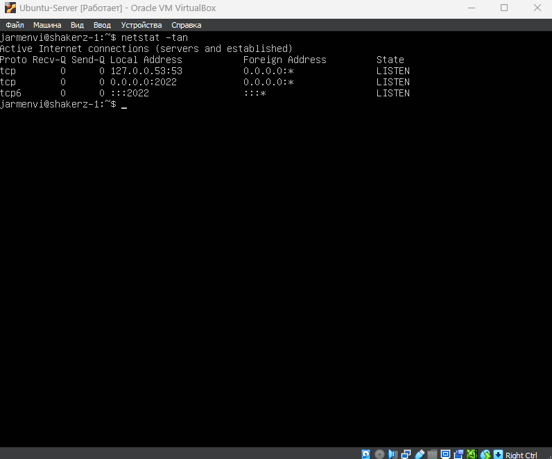 \
Значение ключей -tan, значение каждого столбца вывода, значение 0.0.0.0. \
-a : 	Этот переключатель отображает активные соединения TCP, соединения TCP с состоянием прослушивания, а также прослушиваемые порты UDP. \
-n : 	Используйте  ключ -n  , чтобы предотвратить попытки netstat определить  имена хостов  для внешних IP-адресов. В зависимости от ваших текущих сетевых подключений использование этого переключателя может значительно сократить время, необходимое для полного выполнения netstat. \
-t : 	Используйте  ключ -t, чтобы отобразить текущее состояние разгрузки TCP Chimney вместо обычно отображаемого состояния TCP. \
Разгрузка TCP- это сетевая технология, которая помогает перенести рабочую нагрузку из ЦП в сетевой адаптер во время передачи сетевых данных. \
В колонке Proto указано название протокола \
В колонке Local Address указаны IP-адреса вместе с портом \
В колонке Foreign Address также указано полное доменное имя вместе с этим портом \
В колонке State указано состояние TCP этого конкретного соединения \
0.0.0.0 IP-адресс - это немаршрутизируемый адрес IPv4, который можно использовать в разных целях, в основном, в качестве адреса по умолчанию или адреса-заполнителя. \

## Part 9. Установка и использование утилит top, htop
top \
- uptime - 22 min
- количество авторизованных пользователей - 1
- общую загрузку системы - 0.00, 0.00, 0.00
- общее количество процессов - 111
- загрузку cpu - 0.0 us, 0.1 sy
- загрузку памяти - 168.0 used, 353.9 buff/cache
- pid процесса занимающего больше всего памяти - 709
- pid процесса, занимающего больше всего процессорного времени - 223

htop\
htop sorted by PID \
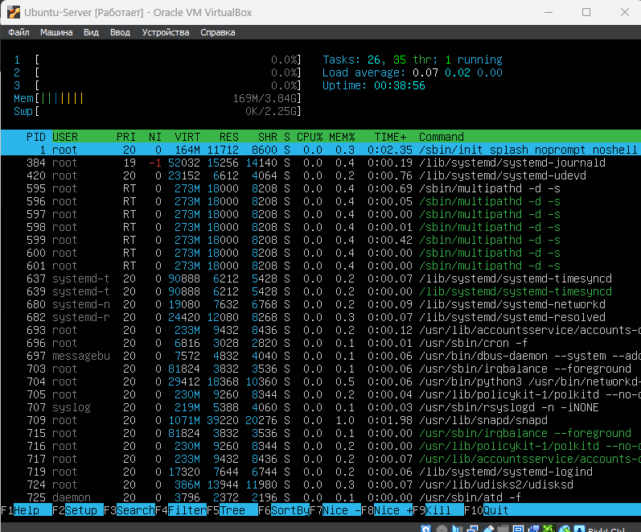 \
htop sorted by PERCENT_CPU \
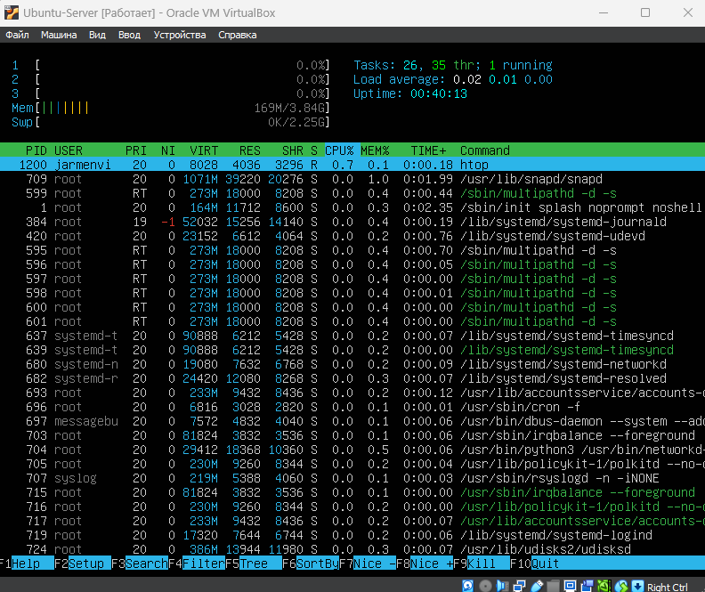 \
htop sorted by PERCENT_MEM \
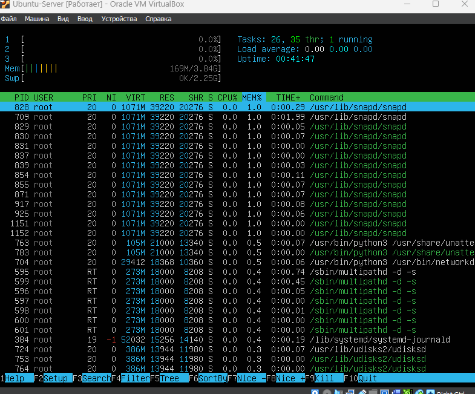 \
htop sorted by TIME \
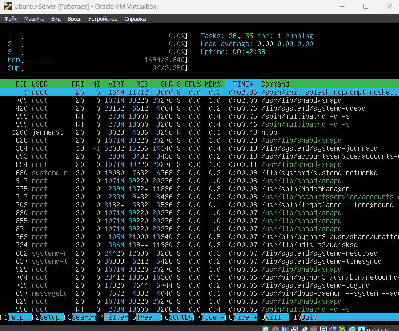 \
htop Filter sshd \
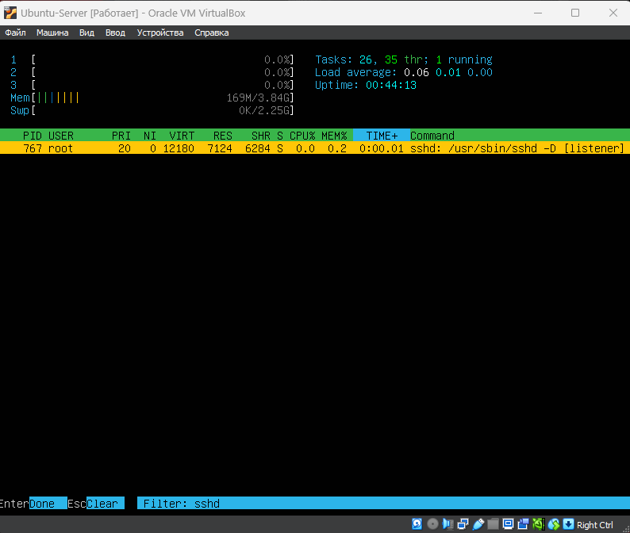 \
htop Search syslog \
 \
htop Setup \
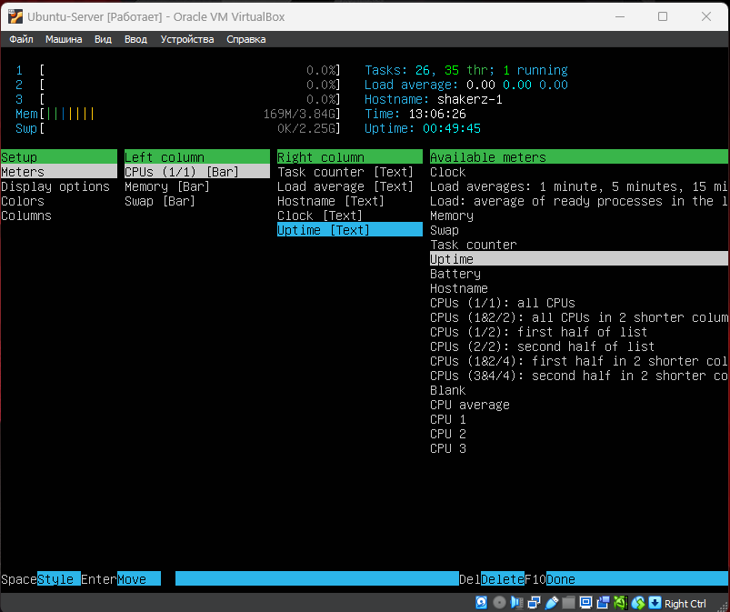 \

## Part 10.Использование утилиты fdisk
- название жесткого диска - VBOX HARDDISK ;
- размер - 25 GiB;
- количество секторов - 52428800 sectors;
- размер swap - swap в моем случа использует файл, а не разделы диска, так что его нельзя отследить командой fdisk, но, просмотрев размер swap файла командой swapon -s, можно сказать что размер swap 2359292 bytes.

## Part 11. Использование утилиты df
df
- размер раздела - 11758760
- размер занятого пространства - 5576048
- размер свободного пространства - 5563604
- процент использования - 51% \
Исходя из вывода команды fdisk -l из прошлого задания можно сделать вывод что единица измерения KiB.

df -Th
- размер раздела - 12G
- размер занятого пространства - 5.4G
- размер свободного пространства - 5.4G
- процент использования - 51% \
Тип файловой системы указан в колонке Type, следовательно корневой раздел имеет файловую систему ext4.

## Part 12. Использование утилиты du

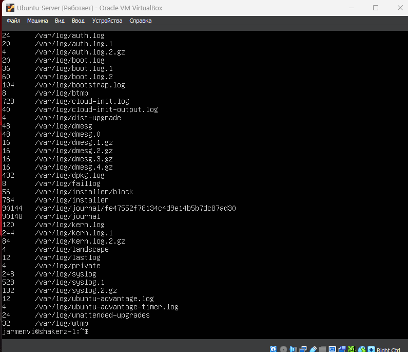

## Part 13. Установка и использование утилиты ncdu
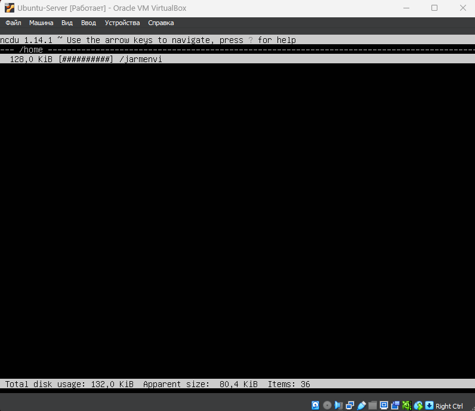

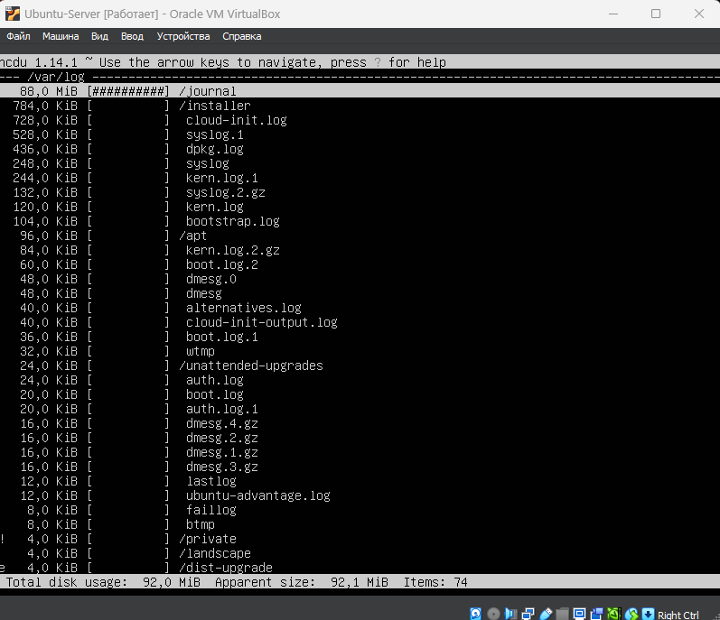

## Part 14. Работа с системными журналами
- время последней успешной авторизации - Apr 30 22:57:31
- имя пользователя - jarmenvi
- метод входа в систему - LOGIN(uid=0)
\
Рестарт SSHd \
 \
## Part 15. Использование планировщика заданий CRON
Выполнение задачи CRON \

Текущие задачи \
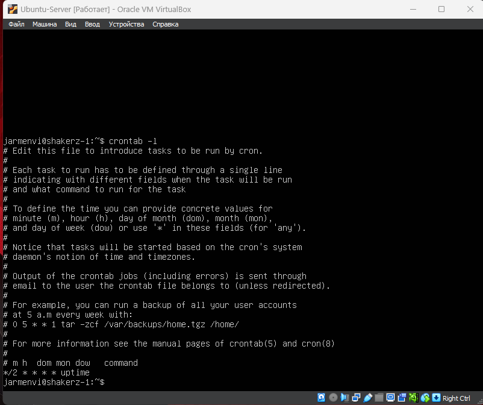

Список задач после удаления \
